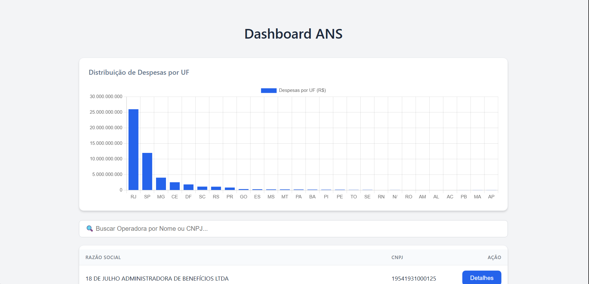
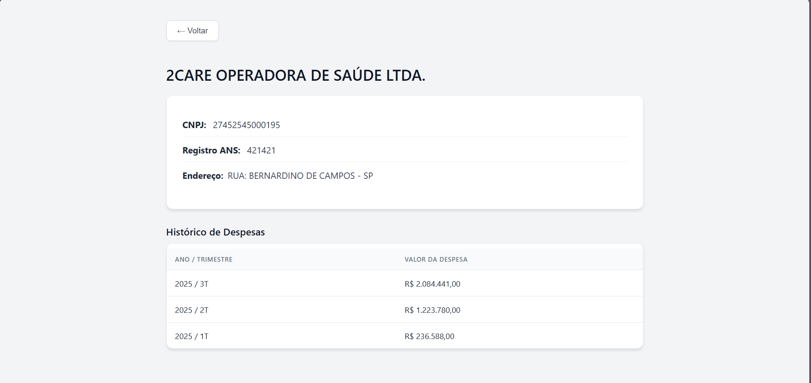

# 🏥 Teste Técnico - Engenharia de Dados (ANS)

Este projeto implementa uma solução completa (End-to-End) para análise de dados financeiros de operadoras de planos de saúde. O pipeline abrange desde a extração automática de dados públicos da ANS (ETL), modelagem em banco de dados SQL, construção de API RESTful com FastAPI e uma interface web interativa com Vue.js.

## 🚀 Funcionalidades

### 1. Extração Automática (`src/etl/extraction.py`)
- **Automação de Datas:** O script calcula automaticamente a data atual e busca os últimos 3 trimestres disponíveis.
- **Margem de Segurança:** Lógica de "lag" (atraso) de 120 dias para respeitar o calendário de publicação da ANS.
- **Resiliência:** Tratamento de erros de conexão e verificação de integridade (hash/tamanho) dos arquivos ZIP.

### 2. Transformação e Enriquecimento (`src/etl/transformation.py`)
- **Limpeza:** Padronização de encoding (`Latin1` para `UTF-8`) e tratamento de separadores CSV.
- **Enriquecimento:** Cruzamento de dados financeiros com dados cadastrais (Cadop) via CNPJ.
- **Validação:** Verificação automática de integridade de CNPJ (Módulo 11).

### 3. Banco de Dados e Carga (`src/etl/load.py` & `database/`)
- **Pipeline SQL:** Orquestração automática de scripts `.sql` numerados para garantir a ordem de execução (DDL -> DML -> DQL).
- **Segurança:** Uso de variáveis de ambiente (`.env`) para ocultar credenciais do banco.
- **Performance:** Utilização de `LOAD DATA LOCAL INFILE` para ingestão em massa (bulk load) de arquivos CSV.

### 4. API e Backend (`src/api/main.py`)
- **Alta Performance:** Construída com **FastAPI** (ASGI) para respostas assíncronas rápidas.
- **Documentação Automática:** Integração nativa com Swagger UI e Redoc.
- **Segurança de Tipos:** Validação de dados de entrada e saída via **Pydantic**.
- **Features:** Paginação real (offset-based), filtros de busca e endpoints analíticos pré-calculados.

---

## 💻 Back-end (Python) - Trade-offs e Decisões

### 1. Estratégia de Processamento (Item 1.2)
Optei pelo processamento **em memória (In-Memory)** utilizando Pandas.
- **Justificativa:** O volume total dos arquivos trimestrais (aprox. 150MB) cabe confortavelmente na RAM. O processamento em stream (chunks) adicionaria complexidade desnecessária para este volume.

### 2. Validação de Dados (Item 2.1)
**Desafio:** Como tratar registros financeiros com CNPJs matematicamente inválidos?
- **Estratégia:** *Flagging & Keeping* (Sinalizar e Manter).
- **Justificativa:** Em auditorias contábeis, a integridade da soma financeira é prioritária. Um erro de digitação no cadastro do CNPJ não anula a existência da despesa monetária.

### 3. Enriquecimento e Joins (Item 2.2)
**Desafio:** Garantir que despesas não sejam perdidas se a operadora não estiver no cadastro (Cadop).
- **Estratégia:** `Left Join` utilizando o CNPJ.
- **Justificativa:** Garante a integridade financeira. Campos cadastrais faltantes são preenchidos com "N/D".
- **Deduplicação:** O Cadop sofre `drop_duplicates(keep='last')` antes do join para evitar produto cartesiano (multiplicação de linhas).

### 4. Modelagem de Dados (Item 3.2)
**Trade-off: Normalização vs Desnormalização**
- **Estratégia:** Híbrida.
    - **Tabela `operadoras`:** Normalizada (3FN). Endereços foram separados em uma tabela `enderecos_operadoras` para evitar redundância e anomalias de atualização.
    - **Tabela `despesas_agregadas`:** Desnormalizada.
- **Justificativa:** A normalização facilita a manutenção cadastral, enquanto a tabela agregada desnormalizada otimiza a leitura para dashboards analíticos (BI), evitando JOINs custosos em tempo de leitura.

### 5. Ingestão e Encoding (Item 3.3)
**Desafio:** Arquivos fonte em `Latin1` vs Banco de dados em `UTF-8`.
- **Solução:** Tabelas criadas com charset `utf8mb4`. Comando de importação configurado com `CHARACTER SET latin1`.
- **Justificativa:** Delega ao MySQL a tarefa de conversão de encoding durante a ingestão, garantindo que acentos (ex: "São Paulo") sejam armazenados corretamente sem corromper os dados originais.

### 6. Queries Analíticas (Item 3.4)
**Desafio:** Comparar performance de operadoras com dados faltantes.
- **Estratégia:** Uso de `Common Table Expressions (CTEs)` e agregação prévia (`SUM/GROUP BY`).
- **Justificativa:**
    - **CTEs:** Melhoram a legibilidade e manutenção do código em comparação a subqueries aninhadas.
    - **Agregação:** Necessária para tratar casos onde uma operadora possui múltiplos lançamentos no mesmo trimestre, evitando distorções no ranking de crescimento.

### 7. Framework da API (Backend) (Item 4.2.1)
**Decisão:** FastAPI (vs Flask).
- **Justificativa:**
    1.  **Documentação:** Gera Swagger UI nativo (requisito implícito para testes de API).
    2.  **Performance:** Suporte nativo a *async/await* para I/O de banco de dados.
    3.  **Segurança de Tipos:** Previne erros de "NullPointer" e tipos incorretos comuns em APIs dinâmicas usando Pydantic.

### 8. Estratégia de Paginação e Filtro (4.2.2)
**Decisão:** Offset-based (`LIMIT` / `OFFSET`) e Server-side Filtering.
- **Justificativa:**
    - **Paginação:** Como os dados são históricos e fechados trimestralmente, não sofremos com "deslocamento de registros" (fantasmas). É a abordagem mais simples para navegação tabular.
    - **Filtro:** Filtrar no servidor (`WHERE ... LIKE`) é mandatório para escalabilidade, evitando trafegar megabytes de JSON para o cliente.

### 9. Otimização de Consultas (Cache vs Pré-cálculo) (4.2.3.)
**Decisão:** Pré-cálculo em Tabela (Data Mart).
- **Justificativa:** Como os dados da ANS têm baixa frequência de atualização (trimestral), o uso de Cache em Memória (Redis) traria complexidade desnecessária. A tabela `despesas_agregadas` criada no ETL funciona como um cache persistente e robusto.

### 10. Estrutura de Resposta da API (Envelope vs Flat List)(4.2.4.)
**Decisão:** Opção B - Resposta Envelopada (`{ data: [...], meta: {...} }`).
- **Justificativa:**
    - **Navegabilidade (UX):** Retornar apenas o array de dados (Opção A) impediria o Frontend de saber quantas páginas existem. O envelope com metadados (`total`, `total_pages`) é essencial para construir componentes de paginação completos (ex: "Página 1 de 50").
    - **Extensibilidade:** O padrão envelopado permite adicionar novos campos de controle no futuro (como mensagens de aviso, status ou links HATEOAS) sem quebrar a estrutura de leitura do cliente, que espera os dados sempre dentro da chave `data`.
    - **Padrão de Indústria:** Segue convenções modernas (como JSON:API), facilitando a integração por desenvolvedores terceiros.

---
## 💻 Frontend (Vue.js) - Trade-offs e Decisões

### 1. Estratégia de Busca e Filtro(4.3.1.)
**Decisão:** Opção A - Busca no Servidor (Server-side Search).
- **Justificativa:** - **Performance:** A base da ANS pode crescer para milhares de registros. Filtrar no cliente exigiria baixar todos os dados no início (payload pesado), prejudicando a UX em redes móveis.
  - **Eficiência:** O banco de dados (SQL) é otimizado para filtros textuais e paginação (`LIMIT/OFFSET`), retornando apenas o necessário.

### 2. Gerenciamento de Estado(4.3.2.)
**Decisão:** Opção C - Composables (Vue 3 Composition API).
- **Justificativa:** - **Simplicidade:** A aplicação tem escopos de dados isolados (Lista vs Detalhes). Usar uma store global (Pinia/Vuex) traria boilerplate desnecessário. O uso de `ref/reactive` nativos do Vue 3 é suficiente e mais limpo para este MVP.

### 3. Performance da Tabela(4.3.3.)
**Estratégia:** Paginação Offset-based.
- **Justificativa:** Exibir apenas 10 itens por vez mantém a DOM leve, garantindo renderização instantânea (60fps) mesmo em computadores lentos. Virtual Scrolling seria excesso de engenharia para dados paginados.

### 4. Tratamento de Erros e Loading(4.3.4.)
- **Loading:** Feedback visual imediato (`v-if="loading"`) evita que o usuário veja dados desatualizados ou tabelas vazias durante a requisição.
- **Erros:** Blocos `try/catch` no serviço capturam falhas de rede (500/404), alertando o usuário de forma simples, sem quebrar a aplicação.

## 📊 Arquivos Gerados (`data/processed/`)

1. **`consolidado.csv`**: Base completa de despesas enriquecida.
2. **`despesas_agregadas.csv`**: Relatório analítico final (Totais, Média, Desvio Padrão).
3. **`demonstracoes_contabeis_consolidadas.zip`**: Entrega final compactada.

---

## 📦 Como Executar

### Pré-requisitos
- Python 3.11+
- MySQL Server 8.0+

### Passo 1: Configuração do Ambiente
1. Crie um ambiente virtual e instale as dependências:
   ```bash
   python -m venv .venv
   # Windows:
   .venv\Scripts\activate
   # Linux/Mac:
   source .venv/bin/activate
   
2. pip install -r requirements.txt

### Passo 2: Configuração do Banco de Dados
1. Configure o arquivo `.env` na raiz com suas credenciais do MySQL:
   ```ini
   DB_HOST=localhost
   DB_USER=root
   DB_PASSWORD=sua_senha
   DB_NAME=intuitive_care_test

### Passo 3: Execução do Pipeline ETL
Execute os scripts na ordem abaixo para baixar, tratar e carregar os dados:

1. **Extração:** Baixa os arquivos brutos da ANS.
   ```bash
   python src/etl/extraction.py

2. **Transformação:** Limpa os dados e padroniza para UTF-8.
    ```Bash
    python src/etl/transformation.py

3. **Carga:** Cria o banco de dados e importa os dados processados.
    ```Bash
    python src/etl/load.py

### Passo 4: Iniciar a API
1. Iniciar a API
Suba o servidor de aplicação:
    ```Bash
    uvicorn src.api.main:app --reload
2. Acesse a documentação interativa em: http://127.0.0.1:8000/docs

### Passo 5: Iniciar o Frontend (Vue.js)
O projeto possui uma interface moderna construída com Vue 3 e Vite.

1. Abra um **novo terminal** (mantenha a API rodando no terminal anterior).
2. Entre na pasta `web` e instale as dependências:
   ```bash
   cd web
   npm install
   npm run dev

3. Acesse a aplicação no navegador: https://www.google.com/search?q=http://127.0.0.1:5173
---

### Bloco da Galeria (Visual)


```markdown
---

## 📸 Telas do Projeto

### Dashboard Principal 
Painel com gráfico de distribuição de despesas por UF e tabela interativa com busca server-side.


### Detalhes da Operadora
Visualização detalhada contendo dados cadastrais e histórico financeiro trimestral.


# 🚀 Testes e Documentação da API

> ### Endpoints Principais
| Método | Rota | Descrição |
| :--- | :--- | :--- |
| `GET` | `/api/operadoras` | Lista operadoras com paginação e busca por nome. |
| `GET` | `/api/operadoras/{cnpj}` | Detalhes completos (incluindo Endereço via JOIN). |
| `GET` | `/api/operadoras/{cnpj}/despesas` | Histórico financeiro detalhado (Trimestre a Trimestre). |
| `GET` | `/api/estatisticas` | Dashboard: Total Geral, Média e Top 5 Operadoras. |

### 📬 Postman Collection

> [!TIP]
> **Facilite seus testes!** Uma coleção completa foi incluída para validar a API rapidamente.
> 
> 1. Localize o arquivo `Intuitive_Care_API.json` na raiz do projeto.
> 2. No Postman, clique em **Import** e selecione o arquivo.
> 3. Use as requisições pré-configuradas para validar os endpoints automaticamente.